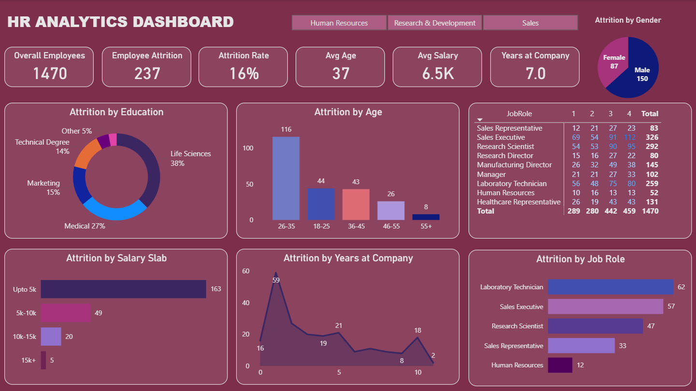

# 📊 HR Analytics Dashboard – Employee Attrition Analysis

 

## 🔎 Overview
Interactive Power BI dashboard analyzing employee attrition across age, salary, job role, education, and tenure.

The goal is to identify high-risk employee segments and enable data-driven HR retention strategies.

### Dashboard File
You can find the file for the dashboard here: [`HR_Analytics_Dashboard.pbix`](HR_Analytics_Dashboard.pbix).  

---

## 📂 Dataset Summary
- Total Employees: 1,470  
- Attrition Cases: 237  
- Attrition Rate: 16%  
- Average Age: 37  
- Average Salary: 6.5K  
- Average Tenure: 7 Years  

---

## 📊 Key Insights
- Highest attrition in 26–35 age group  
- Majority of exits in salary band ≤ 5K  
- Early tenure (1–2 years) shows higher churn  
- Sales & Laboratory roles face higher attrition  
- Life Sciences education background shows highest exits  

---

## 🛠 Tools & Technologies
- Power BI Desktop  
- Power Query  
- DAX  
- Data Modeling  

---

