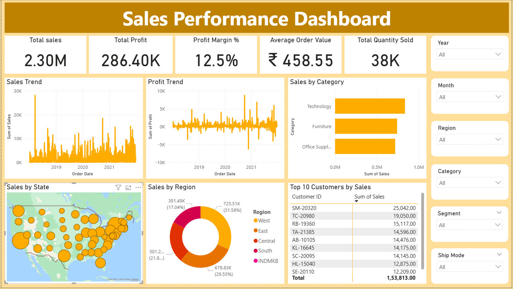

# 📊 Sales Performance Dashboard

 

## 🔎 Overview
Interactive Power BI dashboard analyzing sales, profit, and customer performance across regions, categories, and time.

Designed to support data-driven business decisions and executive reporting.

### Dashboard File
  
You can find the file for the dashboard here: [`Sales_Performance_Dashboard.pbix`](Sales_Performance_Dashboard.pbix)

---

## 📂 Key Metrics
- Total Sales: 2.30M  
- Total Profit: 286.40K  
- Profit Margin: 12.5%  
- Average Order Value: ₹458.55  
- Total Quantity Sold: 38K  

---

## 📊 Dashboard Insights
- Technology is the highest revenue-generating category  
- West region contributes the largest share of sales  
- Sales and profit trends highlight seasonal performance patterns  
- Top 10 customers drive a significant portion of revenue  
- Geographic view identifies high-performing states  

---

## 🛠 Tools Used
- Power BI Desktop  
- Power Query  
- DAX  
- Data Modeling  

---